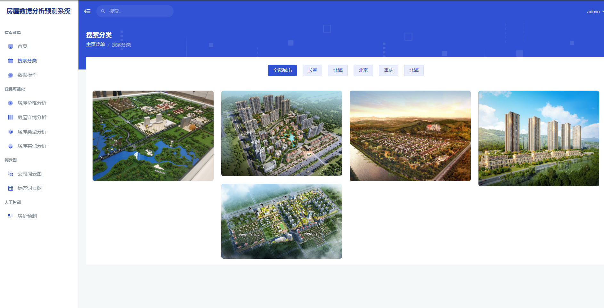
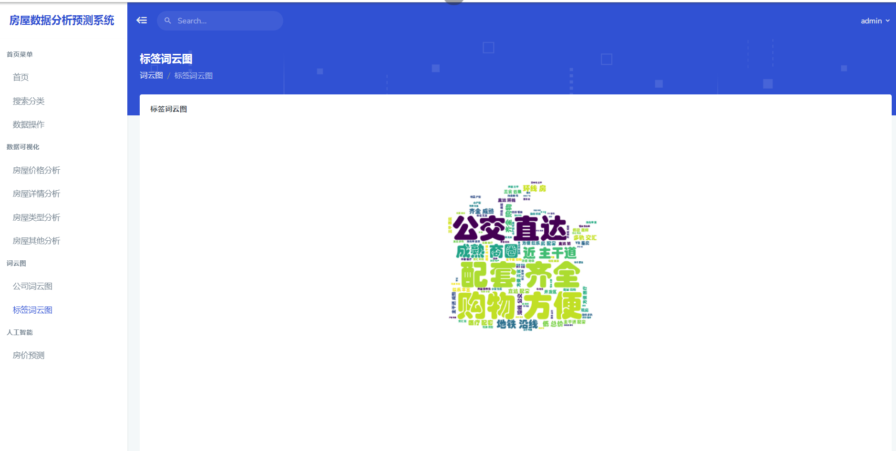

## 计算机毕业设计Python深度学习房价预测 房价可视化 链家爬虫 房源爬虫 房源可视化 卷积神经网络 大数据毕业设计 机器学习 人工智能 AI Hadoop PySpark 机器学习 深度学习 Python Scrapy分布式爬虫 机器学习 大数据毕业设计 数据仓库 大数据毕业设计 文本分类 LSTM情感分析 大数据毕业设计 知识图谱 大数据毕业设计 预测系统 实时计算 离线计算 数据仓库 人工智能 神经网络

## 要求
### 源码有偿！一套(论文 PPT 源码+sql脚本+教程)

### 
### 加好友前帮忙start一下，并备注github有偿纯python房价预测
### 我的QQ号是2827724252或者798059319或者 1679232425或者微信:bysj2023nb 或bysj1688

# 

### 加qq好友说明（被部分 网友整得心力交瘁）：
    1.加好友务必按照格式备注
    2.避免浪费各自的时间！
    3.当“客服”不容易，repo 主是体面人，不爆粗，性格好，文明人。

## 开发技术：
基于python一/二手房数据爬虫分析预测系统+可视化 +商品房数据+Flask框架（附源码）
项目介绍
技术栈：
python语言、Flask框架、MySQL数据库、Echarts可视化
sklearn机器学习 多元线性回归预测模型、requests爬虫框架 链家一手房
一手房数据商品房数据、分析可视化预测系统
基于Flask的一手房链家数据采集分析预测系统是一款利用Python的Flask框架，对链家网站上的一手房房源信息进行数据采集、分析和预测的应用系统。
数据采集：系统通过网络爬虫技术，从链家网站上获取一手房房源信息。这些信息包括楼盘名称、开发商、楼盘地址、户型、价格、面积、朝向、装修情况、楼盘特点等。在采集数据时，可以设置关键词、地区筛选、价格范围、楼盘类型等参数，以获取感兴趣的房源信息。

演示视频

https://www.bilibili.com/video/BV1iS421d7Pb/?spm_id_from=333.999.0.0

